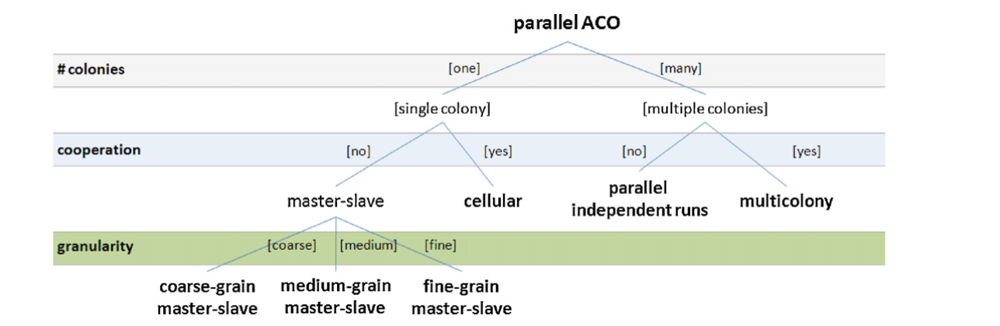

# 15618 Final Project (Parallel Ant Colony Optimization)

By Minghao Liu and Ziteng Shu

## SUMMARY

We are going to implement multiple versions of parallel implementations of the Ant Colony Optimization(ACO) on multi-core CPU platforms, compare and analyze the trade-off and performance across these methods. OpenMP and OpenMPI will be used in this project.
As various approaches(parallel models) have been conducted with different emphasis.
A detailed analysis will be useful and necessary. Here in this project, we are considering three factors: number of colonies, cooperation mode and granularity.


## BACKGROUND

**Algorithm explanation**:
The Ant Colony Optimization is a class of optimization algorithms that was modeled by the behavior of real ants.  Artificial 'ants' (e.g. simulation agents) locate optimal solutions by moving through a parameter space representing all possible solutions. And ants will leave pheromones to influence the exploration of others. The evaluation of the solution will decide how pheromones are preserved. The application that built on the algorithm will be the classic Travelling salesman problem (Vehicle routing problem). Given a graph of cities with different weights on the edge (distance), we should find the approximate optimal solution in this sense. The high level pseudocode is as following:

```
procedure ACO_MetaHeuristic is
    while not terminated do
        generateSolutions()
        daemonActions()
        pheromoneUpdate()
    repeat
end procedure
```
The generateSolutions() function will mainly take advantage of some heuristic function to generate a path. The dameonActions() function will mainly compare the paths found by different “ants”. Finally the pheromoneUpdate() function will update the pheromone information that is shared across the “ants”.  Since the ant colony algorithm relies on “ants” exploring a large search space, the computation is too heavy for the sequential implementation. Thus, parallel design should naturally fit into the implementation. Following is a graph of categorized different Ant colony Optimization on CPU. Our project will focus on implementing and analyzing these approaches.



There are three major factors in the parallel design: #colonies, cooperation mode and granularity. From the perspective of parallel problems, cooperation is a crucial design choice that could greatly affect the performance. Some evaluation metrics include Computational efficiency, speedup and quality of the results.

**Master-slave model**. This category applies a hierarchical parallel model, where a master process manages the global information(i.e. pheromone matrix, best-so-far solution, etc.) and it also controls a group of slave processes that perform subordinated tasks,related to the ACO search space exploration. The model includes three distinguished subcategories regarding the granularity.

**Cellular model**. A single colony is structured in small neigh-borhoods, each one with its own pheromone matrix. Each ant is placed in a cell in a toroidal grid, and the trail pheromone update in each matrix considers only the solutions constructed by the ants in its neighborhood. The model uses overlapping neighborhoods, so the effect of finding high-quality solutions gradually spreads to other neighborhoods using the diffusion model employed in cellular evolutionary algorithms

## CHALLENGE 

1.  Since our project is focusing on analyzing various parallel models based on OpenMP and OpenMPI. There will be plenty of implementation requirements throughout the process. Table 1 describes the models we are going to implement.

| Model                     | Population organization       | \# Colonies | \# Pheromone matrices | Communication frequency |
| ------------------------- | ----------------------------- | ----------- | --------------------- | ----------------------- |
| Coarse-grain master-slave | Hierarchical, non-cooperative | One         | One                   | Medium                  |
| Medium-grain master-slave | Hierarchical, non-cooperative | One         | One                   | Medium-High             |
| Fine-grain master-slave   | Hierarchical, non-cooperative | One         | One                   | High                    |
| Cellular                  | Structured, cooperative       | One         | Many                  | Medium                  |
| Parallel independent runs | Distributed, non-cooperative  | Several     | Several               | Zero                    |
| Multicolony               | Distributed, cooperative      | Several     | Several               | Low                     |
| Hybrids                   | Hierarchical                  | D/P         | D/P                   | D/P                     |

2.  As is stated in the ACO, the pheromone is shared across the colonies through the graph. During cooperation mode, how to share and update the pheromone effectively by shared memory model and message passing model is a challenge.

3. For OpenMPI, we have limited cores. How to design the colony size and divide the workload is one of the crucial factors that affect the computation performance.

## RESOURCES

We have one computer with AMD Ryzen 7 5800H with Radeon Graphics, 16 GB Memory. And we plan to use a GHC machine as well, which has Intel(R) Core(TM) i7-9700 CPU @ 3.00GHz.
We plan to write our own base code and choose a proper problem set. We refer to the summary of the research done by Pedemonte et al. [1]. We need to search for more relevant papers in order to get a better sense of the classical problem sets. Since parallelization of ACO doesn’t need much super computing resources, we cannot benefit from access to special machines.

## GOALS AND DELIVERABLES

1. Plan to achieve

* Implement AOC algorithm to a proper problem set.
* Implement 7 parallel models mentioned above.
* Analyze the advantages and disadvantages of parallel models mentioned above.
* Apply some optimization methods to achieve greater speedups.

2. Hope to achieve 
* Compare with the corresponding algorithm implemented in GPU.
* Analyze the advantages and disadvantages of GPU implementation of the corresponding algorithm

## PLATFORM CHOICE
Describe why the platform (computer and/or language) you have
chosen is a good one for your needs. Why does it make sense to use this parallel system
for the workload you have chosen?

## SCHEDULE

#### Nov.5 - Nov.11 (week1)
* Read papers to learn the details of CPU Ant Colony Optimization implementation.
* Implement a basic serial version ACO based on the above research. (simplified)
* Design idea of OpenMP Parallelization and research on master-slave mode

#### Nov.12 - Nov.18 (week2)
* Using the Master and Slave idea implement the non-corporate version of parallel ACO
* Try Coarse-grain, medium-grain and fine-grain and collect the results.
 
#### Nov.19 - Nov.25 (week3)
* Implement the OpenMPI version of previous design ideas.
* Measure the performance of and record the results.
* Design the cooperation mode of multiple colony ACO.

#### Nov.26 - Dec.1 (week4)
* Implement the corporate multiple colony ACO.
* Refine the method.

#### Dec.1 - Dec.5 (week5)
* Finish implementing cooperation version of multiple colony method
* Measure the performance

#### Dec.5 - Dec.9 (week6)
* Analyze the final version’s performance and wrap up the final project report.
* Conclude the result and prepare for the demo

## REFERENCE
[1] Pedemonte, Martín, Sergio Nesmachnow, and Héctor Cancela. "A survey on parallel ant colony optimization." Applied Soft Computing 11.8 (2011): 5181-5197.

[2] Ant colony optimization algorithms https://en.wikipedia.org/wiki/Ant_colony_optimization_algorithms#Image_processing
